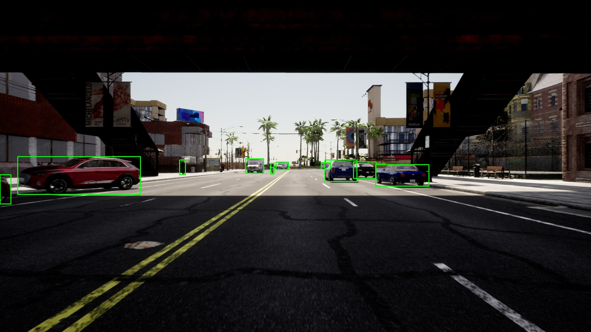
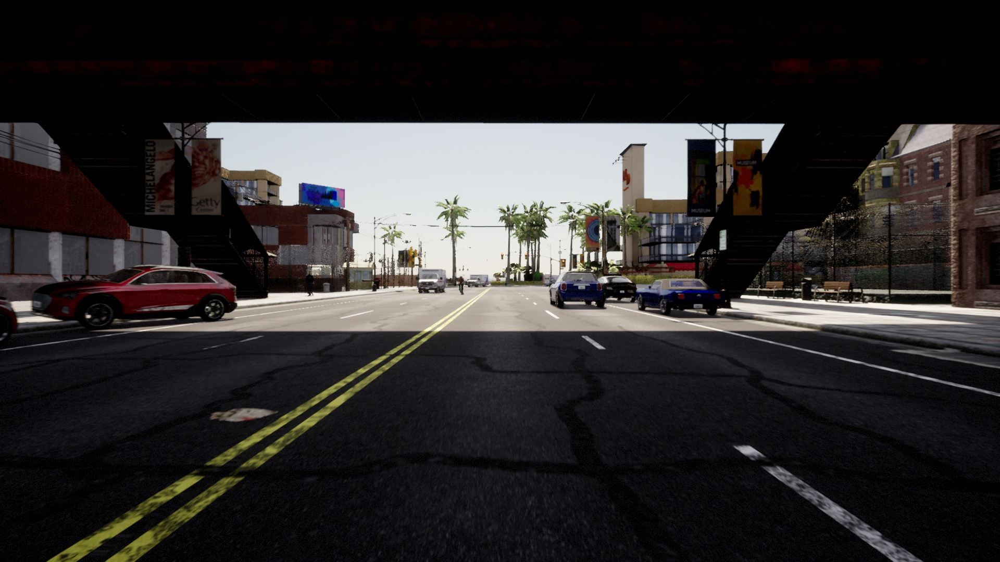
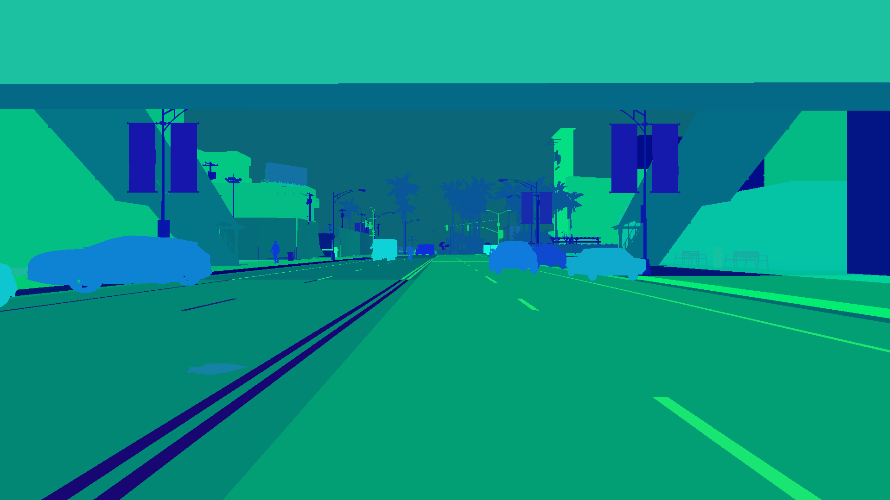

# CARLA Bounding Box Dataset Capture Pipeline

A Python pipeline for automatically generating annotated object-detection datasets from the [CARLA](https://carla.org/) autonomous-driving simulator (version **0.9.15**). It spawns traffic and pedestrians, drives an ego vehicle through a map, and captures pixel-perfect YOLO-format bounding-box labels for cars, trucks, buses, motorcycles, cyclists, and pedestrians — across multiple maps in a single automated run.



---

## Features

- **Multi-map batch capture** — queue up any set of CARLA towns and process them sequentially without manual intervention.
- **Pixel-perfect bounding boxes** — boxes are derived from the actual visible instance-segmentation pixels, not from noisy 3D projections, so they stay tight even under partial occlusion.
- **Planar-depth disambiguation** — overlapping actors are separated using the depth camera's z-buffer (planar) depth, compared on the same scale as the projected actor distance, so detections stay reliable all the way to the edges of the frame.
- **Global instance-ID vote resolution** — instance-ID ownership is resolved per frame by vote count, so an actor partially occluded by another of the same class can no longer steal its identity.
- **Synchronized multi-sensor capture** — RGB, depth, and instance-segmentation images are validated against the same simulation frame ID; desynced frames are skipped rather than written with misaligned labels.
- **Rider / two-wheeler handling** — bikes and motorcycles emit two boxes: one for the vehicle frame and one for the rider.
- **Static parked-car replacement** — baked-in map vehicles (invisible to the segmentation sensor) are hidden and replaced with real detectable actors.
- **Reproducible seeding** — full control over traffic, walker, and ego spawn seeds.
- **Configurable** weather, traffic density, resolution, and FOV via a single dataclass config.
- **Built-in evaluation** — a separate script scores a YOLO model against the generated ground truth and reports precision / recall / F1.

---

## Requirements

| Dependency | Version |
|---|---|
| Ubuntu | 22.04 |
| CARLA Server | 0.9.15 |
| Python | 3.8+ |
| carla (Python egg/wheel) | 0.9.15 |
| numpy | ≥ 1.21 |
| opencv-python | ≥ 4.5 |
| ultralytics (evaluation only) | ≥ 8.0 |

Install the Python dependencies:

```bash
pip install -r requirements.txt
```

The CARLA Python API is provided by the simulator itself. Install the CARLA 0.9.15 Python API by following the official CARLA documentation.

---

## Project Structure

```
.
├── batch_generate.py              # Entry point: runs run_dataset.py for multiple maps
├── run_dataset.py                 # Orchestrates one map: loads world, spawns traffic, runs capture
├── capture_dataset.py             # Core capture loop: sensors, instance mapping, bbox extraction
├── evaluate_yolo_improved_2.py    # Evaluates a YOLO model against the generated ground truth
├── traffic_utils.py               # Traffic & walker spawning, parked-car replacement, cleanup
├── carla_utils.py                 # CARLA helpers: weather, world settings, projection matrix
└── carla_config.py                # All configuration dataclasses (SimulationConfig, etc.)
```

---

## Quick Start

### 1. Start the CARLA server

```bash
cd /opt/carla-simulator
./CarlaUE4.sh -quality-level=Epic -world-port=2000
```

For a headless server (faster, less VRAM):

```bash
./CarlaUE4.sh -RenderOffScreen -world-port=2000
```

### 2. Run a single map

```bash
python run_dataset.py \
  --map Town03 \
  --frames 500 \
  --vehicles 40 \
  --walkers 40 \
  --draw-labels
```

Output is saved to `dataset_Town03/`.

### 3. Run the full batch pipeline

Edit the map list and parameters at the top of `batch_generate.py`, then:

```bash
python batch_generate.py
```

This processes all listed maps in order, saving each to its own folder (`dataset_Town01/`, `dataset_Town02/`, …) with a short cooldown between maps to let the CARLA server settle.

---

## Sample Output

| RGB (training image) | Instance segmentation | Bounding boxes |
|---|---|---|
|  |  |  |

Each map produces the following directory layout:

```
dataset_Town03/
├── pictures/          # Raw RGB frames as JPEG (00000.jpg, 00001.jpg, ...)
├── labels/            # YOLO-format annotation files (00000.txt, 00001.txt, ...)
├── b_picture/         # RGB frames with bounding boxes drawn (for visual verification)
├── instance_seg/      # Raw instance-segmentation images (PNG)
└── semantic_debug/    # Colour-coded semantic map (PNG, for tag debugging)
```

Each `.txt` label file contains one detection per line:

```
<class_id> <center_x> <center_y> <width> <height>
```

All values are normalised to `[0, 1]`.

### COCO-compatible class IDs

| ID | Class |
|---|---|
| 0 | Pedestrian |
| 1 | Bicycle |
| 2 | Car |
| 3 | Motorcycle |
| 5 | Bus |
| 7 | Truck |

(IDs follow the COCO convention, so 4 and 6 are intentionally skipped.)

---

## How It Works

1. **World loading** — the target CARLA map is hot-swapped via the Python API.
2. **Static car replacement** — baked-in environment vehicles are hidden and replaced with spawned actors so they become visible to the instance-segmentation sensor.
3. **Traffic & walker spawning** — vehicles get autopilot via the Traffic Manager; walkers get AI controllers.
4. **Ego vehicle** spawns at a random (or seeded) spawn point and drives on autopilot.
5. **Three synchronized cameras** attach to the ego: RGB, depth, and instance segmentation.
6. **Per-frame pipeline** (synchronous tick):
   - All three sensor images are validated to share the same simulation frame ID; a desynced frame is skipped.
   - The depth image is decoded to a per-pixel **planar (camera-forward) distance**.
   - The instance image is decoded into a semantic-tag map and a 16-bit instance-ID map.
   - For each candidate actor, its 3D bounding box is projected to a padded search window; pixels are filtered by semantic tag and by planar depth (the actor's expected forward distance), then every instance ID in the window casts a vote weighted by its pixel count.
   - **Instance-ID ownership is resolved globally**: candidates are sorted by vote count and assigned greedily, each instance ID and each actor used at most once, so overlapping same-class actors keep their correct identities.
   - For each confirmed actor a **tight bounding box** is computed from its instance pixels, then passed through a minimum visible-pixel check and an **area-scaled fill-ratio** check (lenient for small/fragmented silhouettes, stricter for large near-field actors). Two-wheelers emit a separate box for the frame and the rider.
   - The YOLO label, the raw RGB frame, and a box-overlay review image are written to disk.
7. **Cleanup** — all spawned actors are destroyed and world settings are restored.

---

## Evaluation

`evaluate_yolo_improved_2.py` measures how usable the generated ground truth is by running a pretrained YOLO model over the captured images and comparing its predictions against the generated labels. Predictions are matched to ground truth with greedy IoU matching (highest-confidence first), and the script reports overall and per-class precision, recall, and F1, writes a per-image CSV, and saves colour-coded verification images (green = true positive, red = false positive, blue = missed ground truth).

```bash
python evaluate_yolo_improved_2.py \
  --model yolo11m.pt \
  --dataset dataset_Town03 \
  --conf 0.25 \
  --iou 0.50
```

Example results on a generated set (replace with your own numbers):

| Class | Precision | Recall |
|---|---|---|
| Pedestrian | – | – |
| Car | – | – |
| Truck | – | – |
| **Overall** | **–** | **–** |

---

## Configuration

All settings live in `carla_config.py`. Most can be overridden via command-line flags, or you can edit the dataclasses directly for persistent changes.

### Key `SimulationConfig` fields

| Field | Default | Description |
|---|---|---|
| `host` | `127.0.0.1` | CARLA server address |
| `port` | `2000` | CARLA server port |
| `map_name` | `None` | Map to load. `None` keeps the current map |
| `synchronous_mode` | `True` | Must be `True` for reliable frame-synced capture |
| `fixed_delta_seconds` | `0.05` | Simulation timestep (20 Hz) |
| `ego_blueprint` | `vehicle.tesla.model3` | Ego vehicle type |
| `master_seed` | `None` | Master RNG seed. `None` = random each run |

### Key `CaptureConfig` fields

| Field | Default | Description |
|---|---|---|
| `max_frames` | `50` | Frames to capture per run |
| `img_width` / `img_height` | `1920` / `1080` | Camera resolution |
| `fov` | `90.0` | Camera horizontal field of view (degrees) |
| `min_box_area` | `150` | Minimum bbox area in pixels to keep a detection |
| `depth_tolerance_meters` | `2.5` | Depth-match tolerance added to each actor's bbox half-diagonal |
| `min_visible_ratio` | `0.15` | Upper bound on the area-scaled fill-ratio filter |
| `max_render_distance` | `120.0` | Skip actors beyond this distance (metres) |

### Key `WeatherConfig` fields

| Field | Default | Description |
|---|---|---|
| `cloudiness` | `0.0` | 0 = clear sky, 100 = overcast |
| `sun_altitude_angle` | `20.0` | 90 = midday, negative = below horizon (night) |
| `precipitation` | `0.0` | Rain intensity, 0–100 |
| `fog_density` | `0.0` | Fog amount, 0–100 |

---

## CLI Reference

### `run_dataset.py`

```
--host           CARLA server host (default: 127.0.0.1)
--port           CARLA server port (default: 2000)
--map            Map name, e.g. Town01, Town03, Town10HD (default: current map)
--frames         Number of frames to capture
--vehicles       Number of traffic vehicles to spawn (default: 30)
--walkers        Number of pedestrians to spawn (default: 10)
--seed           Master RNG seed
--traffic-seed   Seed for traffic spawning
--ego-seed       Seed for ego vehicle spawn point
--walker-seed    Seed for pedestrian spawning
--width          Image width in pixels (default: 1920)
--height         Image height in pixels (default: 1080)
--fov            Camera FOV in degrees (default: 90.0)
--draw-labels    Draw bounding boxes onto b_picture output
--safe           Only spawn car-type vehicles (no bikes/trucks)
--hybrid         Enable hybrid physics mode (better performance)
--car-lights-on  Enable vehicle headlights
```

### `evaluate_yolo_improved_2.py`

```
--model     YOLO model file (default: yolo11m.pt)
--dataset   Dataset folder with pictures/ and labels/ subdirs
--conf      Confidence threshold (default: 0.25)
--iou       IoU threshold for TP/FP matching (default: 0.50)
--classes   Class IDs to evaluate, e.g. --classes 0 2 (default: all)
```

### `batch_generate.py`

Edit the map list and the `frames`, `vehicles`, and `walkers` values at the top of the script, then run it directly. It calls `run_dataset.py` as a subprocess for each map.

---

## Tips

- **Verify semantic tags** — if detections look wrong, add `print(np.unique(semantic_map))` inside the capture loop to confirm the tag values match `TAG_VEHICLES` and `TAG_PEDESTRIANS` in `capture_dataset.py`. Tag values can vary between CARLA builds.
- **Tune depth tolerance** — close-range actors that are occasionally missed can be recovered by raising `depth_tolerance_meters` in `carla_config.py` (it is added to each actor's bounding-box half-diagonal).
- **Headless rendering** — launch CARLA with `-RenderOffScreen` to avoid a GPU display window; this noticeably speeds up capture.
- **Frame warm-up** — the pipeline ticks a few frames before capture to let physics settle. If spawned vehicles are still jittery on the first frame, increase this count in `run_dataset.py`.
- **Long runs** — over very long sessions the CARLA server can accumulate memory; the batch pipeline's cooldown and map reload between runs helps mitigate this.

---

## Known Limitations

- Only a single forward-facing camera is captured, so actors outside the camera frustum (behind or beside the ego) are not labelled.
- Very heavily occluded actors — those with fewer visible pixels than the minimum threshold — are intentionally left unlabelled to avoid unreliable boxes.
- Fine-grained class assignment relies on matching CARLA blueprint names, so an unrecognised vehicle blueprint falls back to the generic `car` class.

---

## License

Released under the MIT License — see [`LICENSE`](LICENSE).